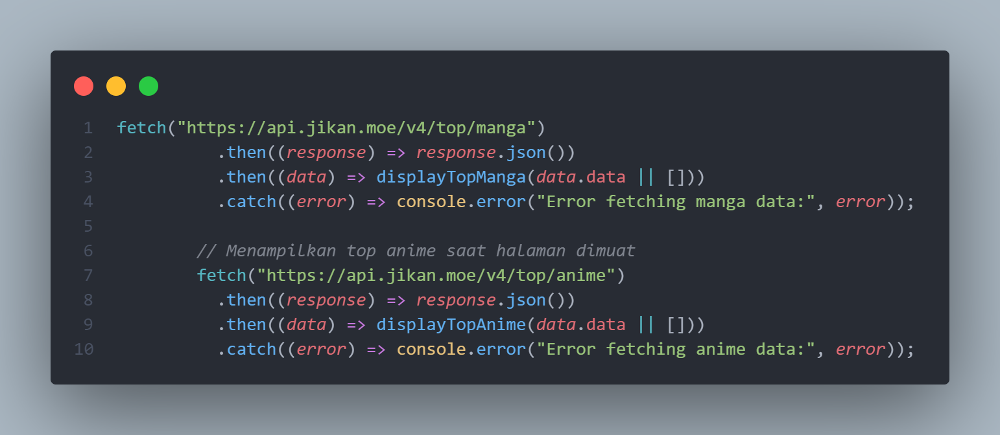
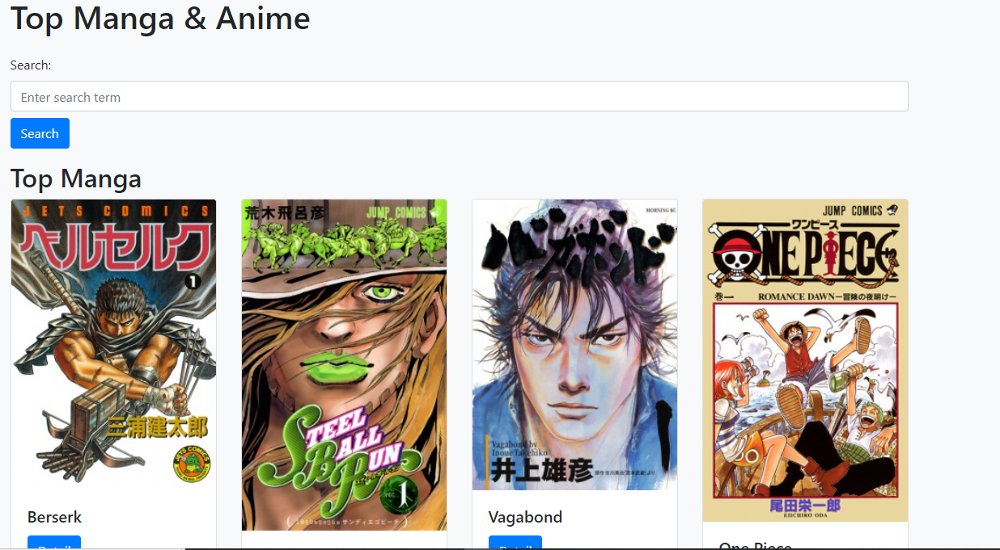

# MangaNimeTest

This is a ManganimeTest Project

For more information, visit our [website](https://manganimetest.netlify.app/).

## Features

- Top Manga
- Top Anime
- Searching Manga Dan Anime

## Usage

1. Clone the repository: `git clone https://github.com/INDOHACKER-XODE/tester.git`
2. or copy code index.html
3. paste your text editor

## Screenshots

## Donate

If you find this project helpful and would like to support its development, consider making a donation. We accept contributions through the following platforms:

- **PayPal:**
  [

- **GoPay:**
  Scan the GoPay QR code below or use the provided GoPay number:
  
  GoPay Number: `085811683696`

Your generous contributions help us maintain and improve MangaNimeTest.

## Contributing

If you'd like to contribute to this project, please follow these guidelines.

1. Fork the repository
2. Create a new branch: `git checkout -b git/new-git`
3. Make your changes
4. Commit your changes: `git commit -m 'Add new git`
5. Push to the branch: `git push origin git/new-git`
6. Submit a pull request

## License

This project is licensed under the MIT License - see the [LICENSE](LICENSE) file for details.
